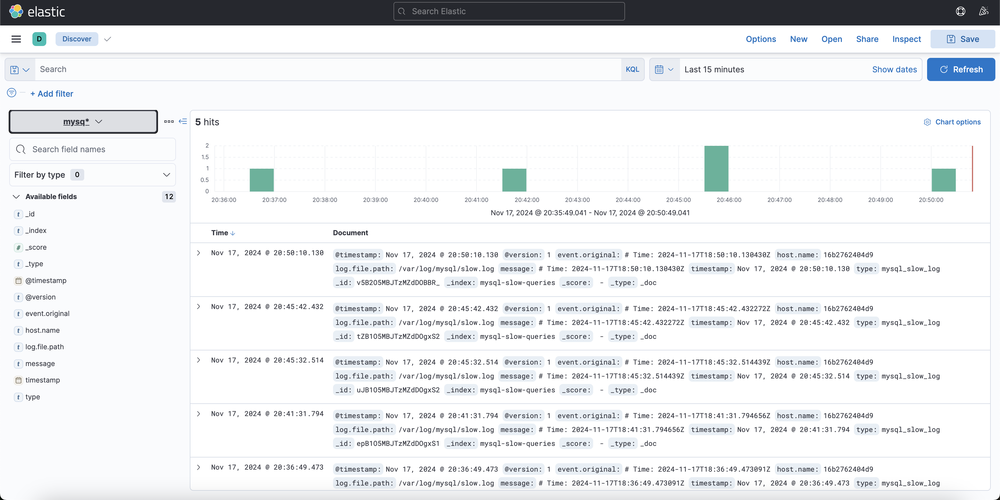

# HW15_Logging

## Setup
1. `docker compose up`
2. Create index in Kibana to observe the data according to logstash config - `mysql-slow-logs`

### Run queries in mysql
````USE testdb;
CREATE TABLE test_table (
id INT AUTO_INCREMENT PRIMARY KEY,
value VARCHAR(255)
);

INSERT INTO test_table (value) VALUES
('Test 1'), ('Test 2'), ('Test 3'), ('Test 4'), ('Test 5');
````
### Run command in terminal
```docker exec -it mysql mysql -u testuser -p testdb -e "SELECT SLEEP(2);"
docker exec -it mysql mysql -u testuser -p testdb -e "SELECT * FROM test_table WHERE id = 1;"
docker exec -it mysql mysql -u testuser -p testdb -e "SELECT SLEEP(5);"
docker exec -it mysql mysql -u testuser -p testdb -e "SELECT SLEEP(12);"
```

## Results

